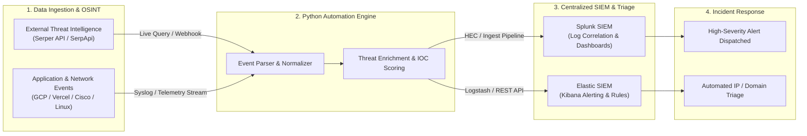

<!--
======================================================================
  MOHAMED ABDELGAWAD | GITHUB PROFILE README
  Dual Identity: Software Engineer & SOC Analyst (DevSecOps / AppSec)
  GitHub Username: Mzdo25
  Contact: mgoda3071@gmail.com
======================================================================
-->

<!-- CAPSULE RENDER HEADER -->

<!-- TYPING SVG ANIMATION -->

 

<!-- TOP STATUS BADGES & VISITOR COUNTER -->

  
  
  
  
  

---

### 🛡️ About Me & Professional Identity

> **"A security-minded developer bridging the gap between application creation and threat mitigation. Experienced in building AI-integrated platforms while actively monitoring, hardening, and securing infrastructure."**

Combining software engineering with SOC expertise positions me at the intersection of **Software Engineering**, **DevSecOps**, and **Application Security (AppSec)**. I don't just write functional code—I architect systems designed to resist exploitation, monitor telemetry in real-time, and automate incident response pipelines.

- 🔭 **Current Endeavors**: Co-architecting **Lost In Egypt** (Graduation Project funded by the **ITIDA ITAC Program**) and engineering automated SOC log ingestion workflows.
- 🛡️ **Defensive Operations**: Log analysis and SIEM detection engineering using **Splunk** & **Elasticsearch/Kibana**, backed by **Cisco** enterprise networking fundamentals.
- 💻 **Software Engineering**: Designing resilient full-stack applications with **React**, **Next.js**, **Node.js**, and **Python**, containerized and hosted across **GCP** & **Vercel**.
- 🧠 **AI & Intelligence**: Implementing generative AI workflows via **Google AI Studio (Gemini APIs)** and programmatic OSINT/web scrapers via **Serper API** & **SerpApi**.
- 🔍 **Offensive Auditing**: Web application penetration testing, vulnerability assessment, and API security auditing with **Burp Suite** and **OWASP Top 10** frameworks.
- 🐧 **Infrastructure & Systems**: Hands-on systems administration and server hardening on **Red Hat Enterprise Linux (RHEL)**.

---

### ⚖️ The "Dual-Threat" Grid

| 💻 Software Engineering & Cloud | 🛡️ Security Operations & Defense |
| :--- | :--- |
| **Architecture & Full-Stack Development** Building responsive, high-performance web platforms with modern frontend frameworks and modular backend services. | **SIEM & Security Telemetry** Designing search queries, alerts, and dashboards in **Splunk** and **Elastic SIEM** for proactive threat visibility. |
| **Cloud Deployments & Serverless** Deploying production microservices across **Google Cloud Platform (GCP)** and **Vercel** with automated CI/CD pipelines. | **Network Defense & Analysis** Packet inspection and protocol triage using **Wireshark**; routing, switching, and topology design with **Cisco Networking**. |
| **AI Integration & Intelligence Feeds** Integrating multimodal models using **Google AI Studio (Gemini APIs)**, paired with **Serper / SerpApi** for real-time search extraction. | **Vulnerability Assessment & Auditing** Auditing APIs and web apps for OWASP Top 10 vulnerabilities, conducting proxy interception and tampering via **Burp Suite**. |
| **Product Design & Collaboration** Translating product requirements into interactive design systems using **Figma** and organizing technical roadmaps in **Notion**. | **System Hardening & Governance** Linux systems administration (**RHEL**), least-privilege access control, audit logging, and automated threat hunting playbooks. |

---

### 🧰 Categorized Tech Stack

#### 🚀 Skill Matrix At A Glance

  

#### 🌐 Software Engineering & Cloud Infrastructure

  
  
  
  
  
  
  
  
  
  
  
  

#### 🧠 AI & API Integrations

  
  
  
  
  

#### 🛡️ Security Operations (SOC) & Defensive Engineering

  
  
  
  
  
  
  

#### ⚔️ Offensive Security & Auditing

  
  
  
  

---

### ⚡ Workflow Automation Showcase: Engineering-Driven SOC

One of my core strengths is leveraging software development to eliminate manual, repetitive security operations. Below is the blueprint of my automated threat intelligence and log enrichment pipeline:

#### 🔧 How This Workflow Works:
1. **Automated Indicator Extraction**: Python scripts query **Serper / SerpApi** endpoints to retrieve live context on suspect domains, emerging CVEs, and reputation data.
2. **Log Normalization**: Incoming web server logs (from Vercel / GCP) and system auth logs are enriched with threat intelligence metadata.
3. **SIEM Telemetry Ingestion**: Structured JSON payloads are dispatched directly into **Splunk HTTP Event Collector (HEC)** and **Elasticsearch** indexes.
4. **Actionable Alerting**: Automated correlation rules filter out noise and flag actionable indicators of compromise (IoCs), dramatically speeding up mean time to detect (MTTD).

---

### 🌟 Notable Featured Projects

<table>
  <tr>
    <td width="50%" valign="top">
      <h3 align="center">🏛️ Lost In Egypt (2025–2026)</h3>
      

        
        
        
        
      

      

        A state-of-the-art digital travel companion application co-developed as a graduation project, proudly <b>supported and funded by the ITIDA ITAC Graduation Project Support Program</b>.
      

      <ul>
        <li><b>Architecture</b>: Engineered a secure, full-stack architecture with hardened API gateways, user authentication, and high-availability cloud deployments on <b>Google Cloud Platform (GCP)</b>.</li>
        <li><b>AI Integration</b>: Integrated <b>Google AI Studio (Gemini APIs)</b> for dynamic, context-aware itinerary planning and cultural navigation.</li>
        <li><b>Security by Design</b>: Implemented OWASP best practices, rate-limiting, and input sanitization to safeguard user records and transactional endpoints.</li>
      </ul>
      

        <a href="https://github.com/fagerhu03/lost_in_egypt"><b>Explore Repository ➔</b></a>
      

    </td>
    <td width="50%" valign="top">
      <h3 align="center">🛰️ NASA Space Apps Challenge</h3>
      

        
        
        
      

      

        Selected participant in the world's largest annual global hackathon, competing under strict time limits to solve complex, space-inspired software challenges.
      

      <ul>
        <li><b>Rapid Prototyping</b>: Built and iterated on <b>PetalView</b>, turning raw mission datasets into an interactive, functional software prototype within 48 hours.</li>
        <li><b>Agile Teamwork</b>: Collaborated across cross-functional roles, driving architecture decisions, version control hygiene, and fast software iterations.</li>
        <li><b>Resilient Engineering</b>: Prioritized software stability and clean component breakdown under tight constraints.</li>
      </ul>
      

        <a href="https://github.com/Mzdo25/petalview_nasa_spaceapp"><b>View Project Repository ➔</b></a>
      

    </td>
  </tr>
  <tr>
    <td width="50%" valign="top">
      <h3 align="center">🛡️ SOC Threat Intel & Log Ingestion Pipeline</h3>
      

        
        
        
        
      

      

        An automated security orchestration tool engineered to bridge open-source threat intelligence with enterprise SIEM aggregators.
      

      <ul>
        <li><b>Automated Harvester</b>: Uses <b>Serper API</b> and <b>SerpApi</b> to fetch threat indicators, malicious IPs, and vulnerability advisories.</li>
        <li><b>SIEM Integration</b>: Feeds normalized events to <b>Splunk</b> and <b>Elasticsearch</b> for correlation against live production logs.</li>
        <li><b>Detection Engineering</b>: Pre-built detection queries that identify brute-force scans and anomalous traffic spikes.</li>
      </ul>
      

        <a href="https://github.com/Mzdo25"><b>View SOC Scripts ➔</b></a>
      

    </td>
    <td width="50%" valign="top">
      <h3 align="center">⚡ Modern Web Showcase Platform</h3>
      

        
        
        
      

      

        A high-performance personal web showcase featuring clean UI components, optimized assets, and responsive layout architecture.
      

      <ul>
        <li><b>Production Deployment</b>: Deployed on <b>Vercel</b> with zero-downtime continuous integration.</li>
        <li><b>Design Fidelity</b>: Built with semantic HTML, CSS design tokens, and modular components planned in Figma.</li>
        <li><b>SEO & Accessibility</b>: High Lighthouse scores across performance, accessibility, and best practices.</li>
      </ul>
      

        <a href="https://yehia-yasser.vercel.app"><b>Visit Live Demo ➔</b></a> • <a href="https://github.com/Mzdo25/yehia_yasser"><b>Source Code ➔</b></a>
      

    </td>
  </tr>
</table>

---

### 📊 GitHub Activity & Metrics

<!-- GITHUB STATS & TOP LANGS SIDE-BY-SIDE -->
<table border="0">
  <tr>
    <td align="center">
      
    </td>
    <td align="center">
      
    </td>
  </tr>
</table>

<!-- GITHUB STREAK CARD -->

  

<!-- SNAKE CONTRIBUTION GRAPH -->
<h4>🐍 Contribution Grid Snake Animation</h4>
<picture>
  <source media="(prefers-color-scheme: dark)" srcset="https://raw.githubusercontent.com/Mzdo25/Mzdo25/output/github-contribution-grid-snake-dark.svg">
  <source media="(prefers-color-scheme: light)" srcset="https://raw.githubusercontent.com/Mzdo25/Mzdo25/output/github-contribution-grid-snake.svg">
  
</picture>

---

### 🤝 Let's Connect & Collaborate

I am constantly eager to connect with fellow engineers, security researchers, and innovative teams. Whether you want to discuss **DevSecOps workflows**, **SIEM detection engineering**, **AI platform integrations**, or explore full-time / contract opportunities:

  
  
  
  

<!-- CAPSULE RENDER FOOTER -->

